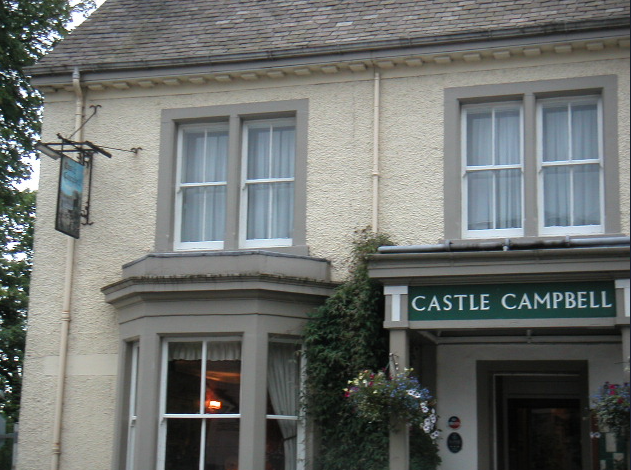
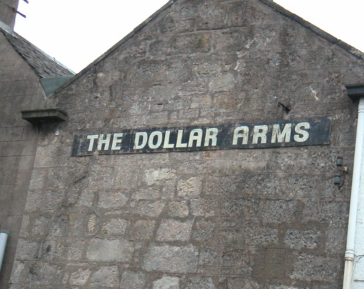
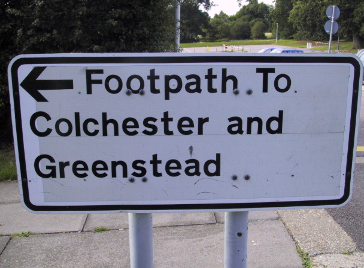
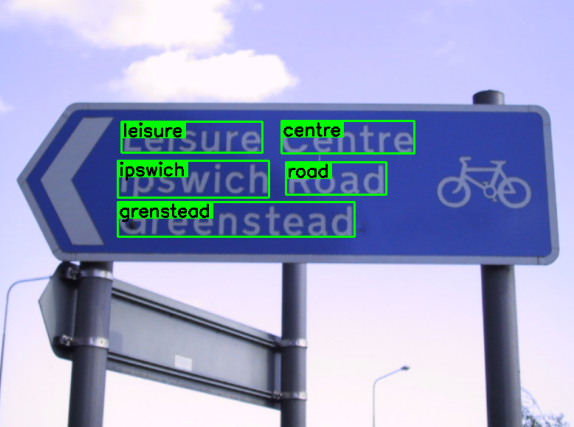
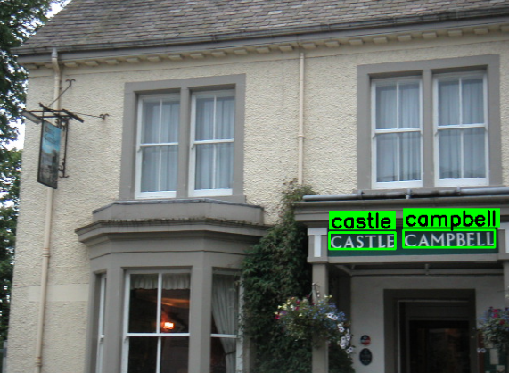
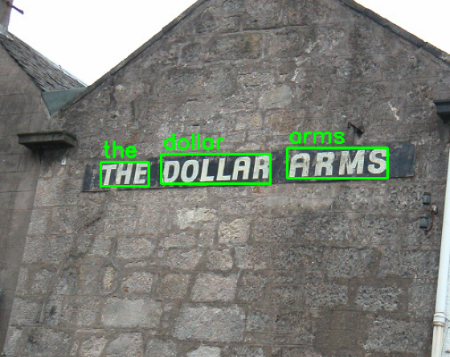
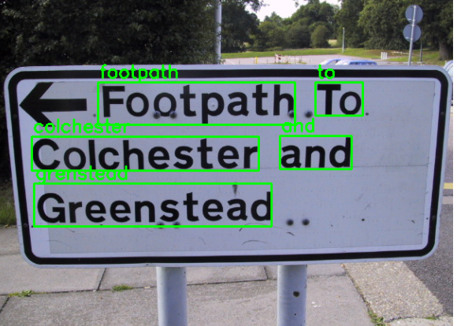
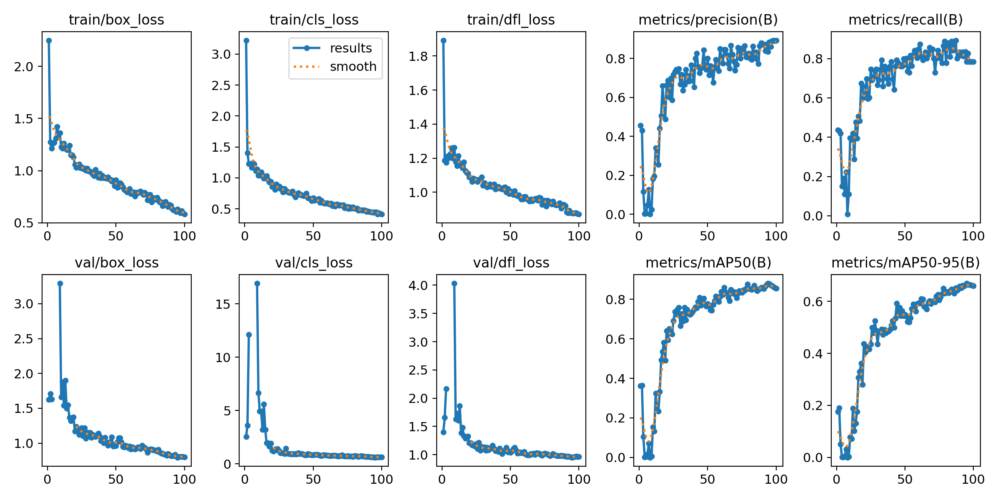
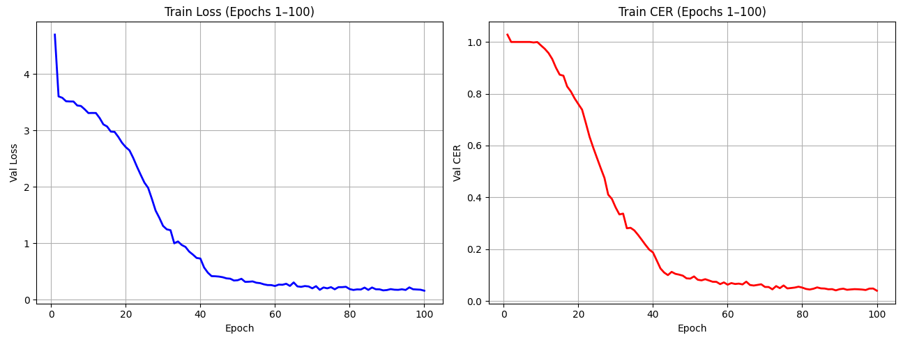
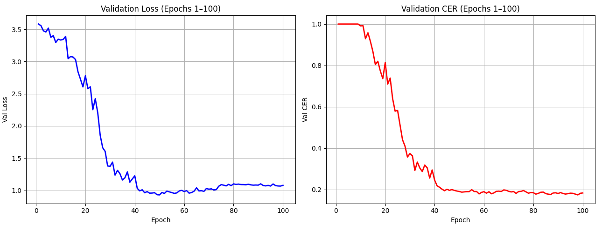

# Scene Text OCR

This project combines **YOLOv11** for text detection and **BiLSTM** for text recognition to build an end-to-end Scene Text OCR system. It is designed to detect and recognize text in natural images (scene text).

---

## Overview

Scene text recognition is a challenging task due to complex backgrounds, varying fonts, distortions, and lighting conditions. This project addresses the problem using:

- **YOLOv11**: A real-time object detector for localizing text regions in images.
- **BiLSTM**: A deep sequence model for recognizing text from detected regions.

---

## Demo
<p align="center">
  
  
  
  
</p>
<p align="center">
  
  
  
  
</p>

### Video Demo

<details>
  <summary>video demo</summary>

  <video src="demo/demo.MOV" controls autoplay muted style="width:100%; max-width:720px; margin-top:10px;"></video>

</details>

---

## Model

### 1. Text Detection - YOLOv11
- Detects text regions from input images.
- Returns bounding boxes around each detected text instance.

<p align="center">
  <br>
  <em>Figure: Detection training and validation</em>
</p>

### 2. Text Recognition - BiLSTM
- Cropped text regions are passed through a CNN-BiLSTM network.
- The CNN uses **ResNet34** to extract features.
- Features are fed into **Bidirectional LSTM** for sequence modeling.
- Uses **CTC loss** for sequence alignment during training.

<p align="center">
  
  <em>Figure: Recognition training</em>
</p>

<p align="center">
  
  <em>Figure: Recognition validation</em>
</p>

---

## Dataset

**Text detection** : https://drive.google.com/drive/folders/1bAHvRxJETifSWpKD-zlUEK_yNCUBLfgB?usp=sharing

**Text Recognition** : https://drive.google.com/drive/folders/1513rGLn1sgr26BbP6QyJ4uMK1zLhJQbw?usp=sharing


---

## Quick Start

### 1. Clone the repository

```
git clone https://github.com/tvtung2902/scene-text-ocr
cd scene-text-ocr
```

### 2. Run

#### a. Quick Test

```
python predict.py
```

#### b. Run the API and HTML interface

```
python app.py
start client/index.html
```

## Contributing

Feel free to open issues or pull requests if you'd like to improve this project or add new features.

## License

This project is open-source and available under the MIT License.

---

Thank you for checking out this project! If you find it useful, feel free to ⭐️ star the repository and share it with others.
