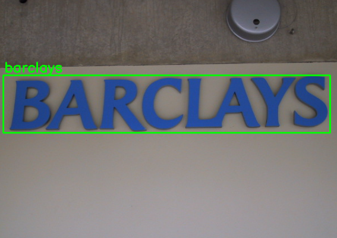

# Scene Text OCR

This project combines **YOLOv11** for text detection and **BiLSTM** for text recognition to build an end-to-end Scene Text OCR system. It is designed to detect and recognize text in natural images (scene text).

---

## Overview

Scene text recognition is a challenging task due to complex backgrounds, varying fonts, distortions, and lighting conditions. This project addresses the problem using:

- **YOLOv11**: A real-time object detector for localizing text regions in images.
- **BiLSTM**: A deep sequence model for recognizing text from detected regions.

---

## Demo

  
  
  
  

  
  
  
  

---

## Model

### 1. Text Detection - YOLOv11
- Detects text regions from input images.
- Returns bounding boxes around each detected text instance.

### 2. Text Recognition - BiLSTM
- Cropped text regions are passed through a CNN-BiLSTM network.
- The CNN uses **ResNet34** to extract features.
- Features are fed into **Bidirectional LSTM** for sequence modeling.
- Uses **CTC loss** for sequence alignment during training.

---

## Dataset

**Text detection** : https://drive.google.com/drive/folders/1bAHvRxJETifSWpKD-zlUEK_yNCUBLfgB?usp=sharing

**Text Recognition** : https://drive.google.com/drive/folders/1513rGLn1sgr26BbP6QyJ4uMK1zLhJQbw?usp=sharing
